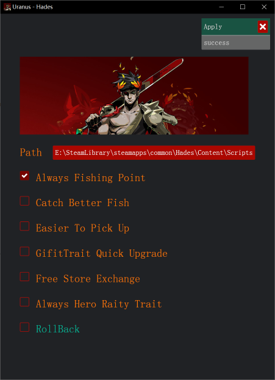

# URANUS

URANUS is a modifier for the game 《Hades》, which is programmed in rust and uses iced as a GUI.

URANUS游戏《哈迪斯》的修改器，用Rust编写，iced作为GUI。

Its shown below:

展示如下：

URANUS offers 6 mods.

- Always Fishing Point:
  - Always eligible to fish, the right spots will appear.
- Catch Better Fish:
  - Increasing the weight of biomefish will catch better fish.
- Easier To Pick Up:
  - Modify the parameters related to fishing to make it easier to start fishing and increase the success rate of fishing.
- GifiTrait Quick Upgrade:
  - Upgrade threshold for tokens changed from 25 to 1.
- Free Store Exchange:
  - Modify broker cost amout to negative.
- Always Hero Raity Trait:
  - It's always heroic raity trait.

RollBack: rollback checked mods.

URANUS 提供了6种修改：

- 总是钓鱼点：
  - 总是有资格钓鱼，在合适的地方就会出现钓鱼点。
- 能钓到更好的鱼:
  - 增加了生物鱼的权重，可以钓到更好的鱼。
- 更容易起竿:
  - 修改了钓鱼的相关系数，可以更加容器起竿，提高钓鱼的成功率。
- 信物快速升级:
  - 信物升级的阈值从25改到1。
- 商场免费购买:
  - 将商品花费改为负值。
- 总是英雄级祝福:
  - 总是英雄级祝福。

回退: 回退所选的修改。

More Mods can refer to "https://github.com/xuqifzz/hades-mod-tutorial"。

更多的修改可以参考"https://github.com/xuqifzz/hades-mod-tutorial"。